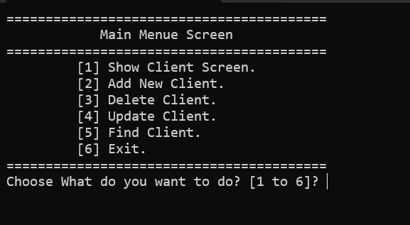
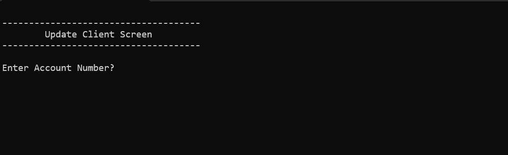
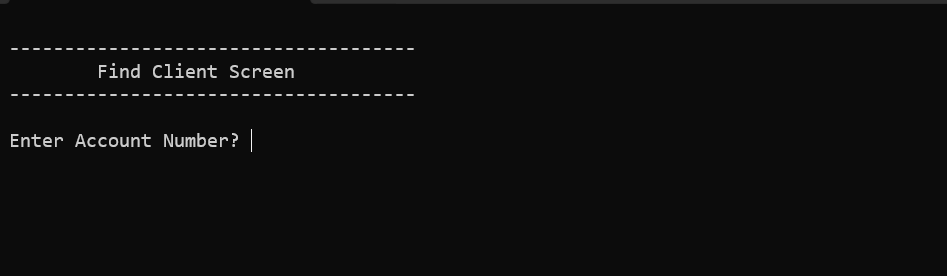

# 🏦 Bank Management System (C++ - Functional Programming)

A command-line Bank Management System built in C++ using **Functional Programming (FP)** concepts. This project implements full client lifecycle management (CRUD operations) backed by local text file persistence.

---

## ⚠️ IMPORTANT REQUIREMENTS BEFORE RUNNING

> 🚨 **Prerequisite File Setup:**  
> Before running the executable or project, you **MUST** create a text file named **`Clients.txt`** in the same directory as the executable/project[cite: 5].
> 
> ### File Format & Delimiter
> Each line in **`Clients.txt`** represents a single client record and **must** be formatted using the delimiter **`#//#`** between fields[cite: 5]:
> 
> ```text
> AccountNumber#//#PinCode#//#Name#//#Phone#//#AccountBalance
> ```
> 
> **Example `Clients.txt` content:**
> ```text
> A101#//#1234#//#John Doe#//#0501234567#//#5000.000000
> A102#//#4321#//#Alice Smith#//#0507654321#//#8500.500000
> ```
> 
> *(Note: Make sure your custom string library header `MyLibs.h` is also present in the project folder[cite: 5]).*

---

## 📸 Screenshots

### 1. Main Menu Screen


### 2. Client List View


### 3. Add New Client Screen


### 4. Update Client Information


### 5. Find & Delete Client Screens


---

## ✨ Features

* **Show Client List:** Displays all registered accounts in a formatted table view[cite: 5].
* **Add New Client:** Validates unique account numbers before adding to prevent duplicates[cite: 5].
* **Update Client Data:** Modify PIN, Name, Phone Number, and Account Balance[cite: 5].
* **Delete Client:** Safe deletion mechanism with confirmation prompts and auto file synchronization[cite: 5].
* **Find Client:** Instant client lookup by Account Number[cite: 5].
* **Data Persistence:** Records are loaded from and saved to `Clients.txt` using `#//#` delimiters[cite: 5].

---

## 🛠️ Technical Highlights

* **Language:** C++
* **Paradigm:** Functional Programming (`struct`, pass-by-reference, vectors)[cite: 5]
* **Persistence:** Native File I/O (`fstream`)[cite: 5]
* **Custom Helper Library:** `MyLibs.h` for custom string splitting logic[cite: 5]
* **Console UI Formatting:** Tabular alignment using `std::setw` and `left` manipulators[cite: 5]

---

## 🚀 How to Run

### Option 1: Using Visual Studio (Recommended)
1. Ensure **`Clients.txt`** and **`MyLibs.h`** are in the project folder[cite: 5].
2. Open `Bank Project course 7 FP.sln` in Visual Studio.
3. Press `Ctrl + F5` to compile and run.

### Option 2: Using Terminal
1. Ensure **`Clients.txt`** and **`MyLibs.h`** are in the working directory[cite: 5].
2. Compile the source code:
   ```bash
   g++ "Bank Project course 7 FP_2.cpp" -o BankSystem.exe
